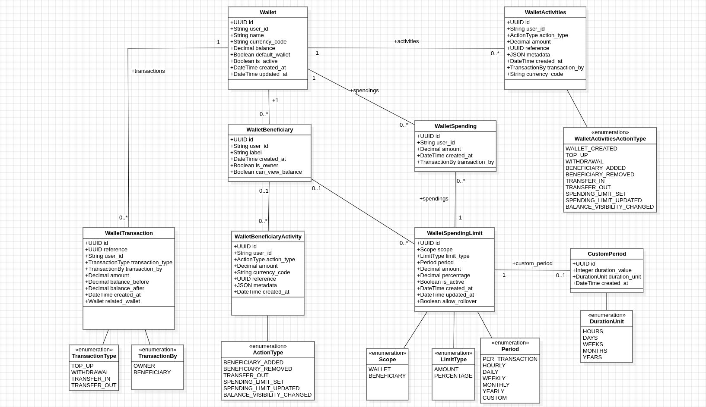

# kunshort-django-wallet 1.0.0

This repository contains a reusable Django app named `wallets` plus a small local-only Django project for development.

The installable package is intended for service consumption: wallet creation, beneficiary management, transfers, spending limits, activity history, and stable numeric error codes.

Package identity:

- Distribution name: `kunshort-django-wallet`
- Version: `1.0.0`
- Python import path: `wallets`

## What is included

- A `Wallet` model owned by `user_id`
- Automatic owner-beneficiary creation for every wallet
- Wallet creation accepts a 3-letter currency code
- Support for multiple wallets per user
- Dedicated wallet activity history via `WalletActivities`
- Dedicated beneficiary activity history via `WalletBeneficiaryActivity`
- Stored spending usage rows via `WalletSpending`
- Custom rolling-window durations via `CustomPeriod`
- A `WalletService` class for wallet creation and retrieval
- A `WalletTopUpService` class for atomic wallet funding
- A `WalletDebitService` class for atomic wallet withdrawals
- A `WalletTransactionHistoryService` class for reading transaction history
- A `WalletBeneficiaryService` class for managing wallet beneficiaries
- A `WalletBeneficiaryHistoryService` class for beneficiary audit history and spending history
- A `WalletTransferService` class for beneficiary-only wallet transfers
- A `WalletSpendingLimitService` class for wallet and beneficiary spending rules
- Local development files for migrations, test execution, and optional API exploration

## Wallet model behavior

- `user_id` is stored as a normalized string identifier
- A single user can create multiple wallets
- Wallet names are unique per user
- Wallet currency is stored as a normalized 3-letter code such as `XAF` or `USD`
- Wallets always start with a `0.00` balance at creation time
- If `currency_code` is not supplied during creation, `XAF` is used
- If `name` is omitted during creation, a generated name such as `PrimaryWallet001` is used
- The first wallet for a user is always created as the default wallet
- Only one wallet per user can be marked as the default wallet at a time

## Data model summary



- `Wallet`: the owned balance container. Includes `default_wallet`, `currency_code`, and `balance`.
- `WalletBeneficiary`: wallet-scoped participants. The owner is automatically stored here as `is_owner=True`.
- `WalletTransaction`: immutable wallet ledger rows. Uses a single `user_id` plus `transaction_by` to distinguish owner vs beneficiary actions.
- `WalletActivities`: wallet-wide audit log for create, top-up, debit, transfer, and spending-limit events.
- `WalletBeneficiaryActivity`: beneficiary-focused audit log for beneficiary add/remove, transfer-out, and beneficiary spending-limit events.
- `WalletSpendingLimit`: wallet-level or beneficiary-level spending rules.
- `WalletSpending`: persisted spending usage rows used when evaluating limits over time.
- `CustomPeriod`: rolling-window duration linked to `WalletSpendingLimit` when `period="custom"`. Stores a `duration_value` and `duration_unit` (hours, days, weeks, months, years) that define a sliding lookback window evaluated at the moment of each spend.

## Identity rules

- There is only one user identifier field per record for wallet actors.
- The wallet owner is also a beneficiary of that wallet by default.
- `WalletBeneficiary.user_id` identifies the participant user.
- `WalletTransaction.user_id` identifies the acting user for that wallet transaction.
- `WalletTransaction.transaction_by` indicates whether the acting user is the `owner` or a `beneficiary`.
- `WalletBeneficiaryActivity.user_id` identifies the beneficiary user the activity is about.

## Run locally

```bash
uv run python manage.py migrate
uv run python manage.py runserver
```

## Management command

Create zero-balance wallets for existing users in the configured Django auth model:

```bash
uv run python manage.py create_system_wallets
uv run python manage.py create_system_wallets --wallet-name "Primary Wallet"
uv run python manage.py create_system_wallets --wallet-name "Primary Wallet" --currency "XAF"
```

The command reads users from Django's active auth user model via `get_user_model()` and only creates a wallet for users who do not already have one.

## Build the package

Build the installable distribution from the project root:

```bash
uv build
```

The built artifacts are written to `dist/`.

The wheel now contains only the reusable `wallets` package. Development-only files such as the local Django project in `config/` and the repository test suite are kept out of the installable package.

The packaged library still includes `wallets.admin`, so consumers who add `wallets` to `INSTALLED_APPS` will be able to view and manage the wallet models from Django admin.

To consume the package in another Django project:

```bash
pip install kunshort-django-wallet==1.0.0
```

Then add `wallets` to `INSTALLED_APPS`, run migrations, and import the service layer from `wallets.services`.

A minimal consumer integration walkthrough is available in `CONSUMER_GUIDE.md`.

## Example service usage

```python
from uuid import uuid4

from wallets.services import (
	WalletBeneficiaryHistoryService,
	WalletBeneficiaryService,
	WalletDebitService,
	WalletService,
	WalletSpendingLimitService,
	WalletTopUpService,
	WalletTransferService,
	WalletTransactionHistoryService,
)

from wallets.exceptions import serialize_wallet_error

wallet = WalletService.create_wallet(
	user_id=uuid4(),
	name="Primary Wallet",  # optional
	currency_code="XAF",   # optional, defaults to XAF
)

wallets = WalletService.list_wallets_for_user(user_id=wallet.user_id)

wallet = WalletService.set_default_wallet(
	user_id=wallet.user_id,
	wallet_id=wallet.id,
)

wallet = WalletTopUpService.top_up_wallet(
	user_id=wallet.user_id,
	wallet_id=wallet.id,
	amount="1500.00",
)

wallet = WalletDebitService.debit_wallet(
	user_id=wallet.user_id,
	wallet_id=wallet.id,
	amount="250.00",
)

history = WalletTransactionHistoryService.list_wallet_history(
	user_id=wallet.user_id,
	wallet_id=wallet.id,
)

beneficiary = WalletBeneficiaryService.add_beneficiary(
	user_id=wallet.user_id,
	wallet_id=wallet.id,
	beneficiary_user_id=uuid4(),
	label="Trusted Recipient",
)

beneficiaries = WalletBeneficiaryService.list_wallet_beneficiaries(
	user_id=wallet.user_id,
	wallet_id=wallet.id,
)

beneficiary_history = WalletBeneficiaryHistoryService.list_beneficiary_history(
	user_id=wallet.user_id,
	wallet_id=wallet.id,
	beneficiary_user_id=beneficiary.user_id,
)

beneficiary_spending_history = WalletBeneficiaryHistoryService.list_beneficiary_spending_history(
	user_id=wallet.user_id,
	wallet_id=wallet.id,
	beneficiary_user_id=beneficiary.user_id,
)

limit_rule = WalletSpendingLimitService.set_wallet_spending_limit(
	user_id=wallet.user_id,
	wallet_id=wallet.id,
	limit_type="amount",
	period="daily",
	amount="5000.00",
)

# Custom rolling-window: 2 000 XAF per every 2 hours
custom_limit_rule = WalletSpendingLimitService.set_beneficiary_spending_limit(
	user_id=wallet.user_id,
	wallet_id=wallet.id,
	beneficiary_user_id=beneficiary.user_id,
	limit_type="amount",
	period="custom",
	amount="2000.00",
	duration_value=2,
	duration_unit="hours",
)

# Daily limit with rollover ON: unspent XAF carries forward to the next day
rollover_limit = WalletSpendingLimitService.set_beneficiary_spending_limit(
	user_id=wallet.user_id,
	wallet_id=wallet.id,
	beneficiary_user_id=beneficiary.user_id,
	limit_type="amount",
	period="daily",
	amount="10000.00",
	allow_rollover=True,
)

beneficiary_limit_rule = WalletSpendingLimitService.set_beneficiary_spending_limit(
	user_id=wallet.user_id,
	wallet_id=wallet.id,
	beneficiary_user_id=beneficiary.user_id,
	limit_type="percentage",
	period="per_transaction",
	percentage="25.00",
)

source_transaction, destination_transaction = WalletTransferService.transfer_to_beneficiary(
	user_id=wallet.user_id,
	source_wallet_id=wallet.id,
	beneficiary_user_id=beneficiary.user_id,
	destination_wallet_id=uuid4(),  # replace with an actual beneficiary wallet id
	amount="100.00",
)

try:
	WalletDebitService.debit_wallet(
		user_id=wallet.user_id,
		wallet_id=wallet.id,
		amount="-10.00",
	)
except Exception as error:
	payload = serialize_wallet_error(error, flat=True)
	# {'erc': 303, 'msg': 'Amount must be greater than 0.'}
```

## Django admin support

The installable package keeps the admin registrations for all wallet models.

To make the models visible in django-admin in a consuming project:

1. Install the package.
2. Add `wallets` to `INSTALLED_APPS`.
3. Ensure `django.contrib.admin` is enabled.
4. Run `python manage.py migrate`.
5. Create or use a superuser and open `/admin/`.

The following models are registered in admin:

- `Wallet`
- `WalletTransaction`
- `WalletBeneficiary`
- `WalletActivities`
- `WalletBeneficiaryActivity`
- `WalletSpendingLimit`
- `WalletSpending`
- `CustomPeriod`

## Top-up validation

- The top-up service validates that the wallet belongs to the supplied user
- The top-up amount must be a valid decimal value greater than `0`
- The balance update runs inside a database transaction and locks the wallet row during the update

## Withdrawal and history

- The debit service uses the same ownership and amount validation rules as top-ups
- The debit service raises an error if the wallet balance is insufficient
- Every top-up and withdrawal writes a transaction history record with the amount, balance before, and balance after
- The history service can return all wallet transactions or filter by transaction type
- Beneficiary-linked transfers are also stored as wallet transactions, with the beneficiary user id written directly on the transaction row

## Default wallet rules

- The first wallet created for a user is always the default wallet.
- Any later wallet created for the same user starts with `default_wallet=False`.
- A user cannot have two default wallets at the same time.
- Calling `WalletService.set_default_wallet(...)` makes the requested wallet the default and automatically sets the previous default wallet to `False`.

## Beneficiaries

- Wallet owners can add beneficiaries to a specific wallet
- Beneficiary creation validates that the wallet belongs to the supplied user
- The wallet owner cannot be added manually as their own beneficiary because they already exist as the default owner-beneficiary
- The same beneficiary cannot be added twice to the same wallet
- The beneficiary service can list all beneficiaries attached to a wallet
- The beneficiary service can also remove a beneficiary from a wallet
- The owner-beneficiary cannot be removed from the wallet
- Beneficiary add, remove, transfer-out, and beneficiary limit events are written to the dedicated `WalletBeneficiaryActivity` history model using a single beneficiary `user_id`
- The beneficiary history service can return all beneficiary actions or only beneficiary spending history
- The wallet transaction history service can also return beneficiary-linked wallet transactions directly

## Balance visibility

- By default, beneficiaries **cannot** see the wallet's balance — only the owner can
- The wallet owner can grant or revoke balance visibility per beneficiary using `WalletBeneficiaryService.set_balance_visibility(...)`
- The `can_view_balance` flag is stored on `WalletBeneficiary` and is `False` by default
- The owner beneficiary always has implicit access; attempting to change visibility for the owner raises error `331`
- A beneficiary with access uses `WalletBeneficiaryService.get_wallet_balance_for_beneficiary(...)` to read the current balance
- A beneficiary without permission raises error `330` (`BALANCE_VISIBILITY_NOT_PERMITTED`)
- Every visibility change is recorded in `WalletActivities` (action type `balance_visibility_changed`) and in `WalletBeneficiaryActivity`

## Transfers and limits

- Transfers are only allowed to users already attached as beneficiaries on the source wallet
- The destination wallet used for a transfer must belong to the beneficiary user
- Transfers create matching `transfer_out` and `transfer_in` history records with the same reference id
- Wallet-level spending limits can be configured by fixed amount or percentage
- Beneficiary-level spending limits can be configured independently per wallet beneficiary
- Spending limits can be updated explicitly with dedicated update services
- Limits support `per_transaction`, `hourly`, `daily`, `weekly`, `monthly`, `yearly`, and `custom` periods
- `custom` periods use a rolling lookback window defined by a duration — for example, `2 hours` means the system sums all spend in the last 2 hours from the moment of each transaction
- Active beneficiary percentage limits for the same wallet and period cannot exceed `100%`
- Re-running the same spending-limit rule updates the existing rule instead of creating duplicates
- Beneficiary limits are caps, not reserved balances, so the wallet owner can still spend from the wallet as long as the actual balance and wallet-level limits allow it

## Error payloads

- Every wallet-domain exception now carries a stable error `code` and `message`
- Use `serialize_wallet_error(error)` for a nested payload: `{"error": {"code": 303, "message": "..."}}`
- Use `serialize_wallet_error(error, flat=True)` for a flat payload: `{"erc": 303, "msg": "..."}`
- The canonical message for a code is available through `get_wallet_error_message(code)` or the `WALLET_ERROR_MESSAGES` mapping
- Codes are stable identifiers for client applications and localization, even if the default English messages change later

## Error code reference

The wallet module uses numeric codes so clients can localize messages independently of the default English text.

### General

| Code | Name      | Default message          |
| ---- | --------- | ------------------------ |
| 300  | `GENERIC` | Wallet operation failed. |

### Amount and currency validation

| Code | Name                          | Default message                                         |
| ---- | ----------------------------- | ------------------------------------------------------- |
| 301  | `INVALID_AMOUNT_FORMAT`       | Amount must be a valid decimal value.                   |
| 302  | `INVALID_AMOUNT_NEGATIVE`     | Amount must be greater than or equal to 0.              |
| 303  | `INVALID_AMOUNT_NON_POSITIVE` | Amount must be greater than 0.                          |
| 304  | `INVALID_PERCENTAGE_FORMAT`   | Percentage must be a valid decimal value.               |
| 305  | `INVALID_PERCENTAGE_RANGE`    | Percentage must be greater than 0 and at most 100.      |
| 306  | `INVALID_CURRENCY_CODE`       | Currency code must be a valid 3-letter alphabetic code. |

### Ownership and beneficiary errors

| Code | Name                                  | Default message                                               |
| ---- | ------------------------------------- | ------------------------------------------------------------- |
| 307  | `WALLET_OWNERSHIP_MISMATCH`           | Wallet does not belong to the supplied user.                  |
| 308  | `BENEFICIARY_NOT_FOUND`               | User is not attached to the supplied wallet.                  |
| 312  | `OWNER_ALREADY_DEFAULT_BENEFICIARY`   | Wallet owner is already the default beneficiary.              |
| 313  | `DUPLICATE_BENEFICIARY`               | Beneficiary already exists for this wallet.                   |
| 314  | `OWNER_BENEFICIARY_REMOVAL_FORBIDDEN` | Wallet owner cannot be removed from the wallet beneficiaries. |

### Transfer errors

| Code | Name                                   | Default message                                             |
| ---- | -------------------------------------- | ----------------------------------------------------------- |
| 309  | `TRANSFER_DESTINATION_WALLET_MISMATCH` | Destination wallet does not belong to the beneficiary user. |
| 311  | `INSUFFICIENT_BALANCE_TRANSFER`        | Wallet balance is insufficient for this transfer.           |
| 328  | `TRANSFER_SOURCE_EQUALS_DESTINATION`   | Source and destination wallets must be different.           |

### Balance and spending errors

| Code | Name                                                   | Default message                                                                                                        |
| ---- | ------------------------------------------------------ | ---------------------------------------------------------------------------------------------------------------------- |
| 310  | `INSUFFICIENT_BALANCE_DEBIT`                           | Wallet balance is insufficient for this debit.                                                                         |
| 315  | `SPENDING_LIMIT_NOT_WALLET_LEVEL`                      | The supplied spending limit is not a wallet-level limit.                                                               |
| 316  | `SPENDING_LIMIT_NOT_BENEFICIARY_LEVEL`                 | The supplied spending limit is not a beneficiary-level limit.                                                          |
| 317  | `SPENDING_LIMIT_AMOUNT_REQUIRED`                       | Amount is required for amount-based spending limits.                                                                   |
| 318  | `SPENDING_LIMIT_PERCENTAGE_REQUIRED`                   | Percentage is required for percentage-based spending limits.                                                           |
| 319  | `SPENDING_LIMIT_TYPE_UNSUPPORTED`                      | Unsupported spending limit type.                                                                                       |
| 320  | `SPENDING_LIMIT_VALIDATION_FAILED`                     | Wallet spending limit configuration is invalid.                                                                        |
| 321  | `SPENDING_LIMIT_CUSTOM_PERIOD_REQUIRED`                | Custom period limits require duration_value and duration_unit.                                                         |
| 322  | `SPENDING_LIMIT_CUSTOM_PERIOD_INVALID`                 | duration_value must be a positive integer of at least 1.                                                               |
| 323  | `SPENDING_LIMIT_WALLET_MISMATCH`                       | The supplied spending limit does not belong to the supplied wallet.                                                    |
| 324  | `SPENDING_LIMIT_TOTAL_BENEFICIARY_PERCENTAGE_EXCEEDED` | Total active beneficiary percentage limits for the same wallet and period cannot exceed 100%.                          |
| 325  | `SPENDING_LIMIT_PER_TRANSACTION_EXCEEDED`              | Requested spend exceeds the configured per-transaction limit.                                                          |
| 326  | `SPENDING_LIMIT_PERIOD_EXCEEDED`                       | Requested spend exceeds the configured spending limit for the active period.                                           |
| 327  | `SPENDING_LIMIT_NO_ACTIVE_CUSTOM_PERIOD`               | No active custom period is configured for this spending limit.                                                         |
| 329  | `SPENDING_LIMIT_ROLLOVER_NOT_SUPPORTED`                | Rollover is only supported for amount-based limits on fixed calendar periods (hourly, daily, weekly, monthly, yearly). |
| 330  | `BALANCE_VISIBILITY_NOT_PERMITTED`                     | You do not have permission to view this wallet's balance.                                                              |
| 331  | `OWNER_BALANCE_VISIBILITY_CHANGE_FORBIDDEN`            | Cannot change balance visibility for the wallet owner — the owner always has access.                                   |

## Service reference

- `WalletService.create_wallet(...)`: creates a wallet with zero opening balance, auto-creates the owner beneficiary, uses `XAF` when currency is omitted, auto-generates a name when one is not provided, and sets only the first wallet as default.
- `WalletService.set_default_wallet(...)`: switches the default wallet for a user.
- `WalletService.list_wallets_for_user(...)`: lists a user’s wallets.
- `WalletTopUpService.top_up_wallet(...)`: credits a wallet owned by the supplied user.
- `WalletDebitService.debit_wallet(...)`: debits a wallet owned by the supplied user and enforces spending limits.
- `WalletTransactionHistoryService.list_wallet_history(...)`: returns wallet transaction history.
- `WalletTransactionHistoryService.list_beneficiary_wallet_history(...)`: returns wallet transactions for a beneficiary user within one wallet.
- `WalletBeneficiaryService.add_beneficiary(...)`: adds a new beneficiary to a wallet.
- `WalletBeneficiaryService.remove_beneficiary(...)`: removes a non-owner beneficiary from a wallet.
- `WalletBeneficiaryService.set_balance_visibility(...)`: grants or revokes the ability for a beneficiary to read the wallet balance.
- `WalletBeneficiaryService.get_wallet_balance_for_beneficiary(...)`: returns the wallet object for a beneficiary that has balance visibility.
- `WalletBeneficiaryService.list_wallet_beneficiaries(...)`: lists all beneficiaries, including the owner-beneficiary.
- `WalletBeneficiaryHistoryService.list_beneficiary_history(...)`: returns beneficiary activity history.
- `WalletBeneficiaryHistoryService.list_beneficiary_spending_history(...)`: returns beneficiary spending-related activity only.
- `WalletSpendingLimitService.set_wallet_spending_limit(...)`: creates or updates a wallet-level spending rule.
- `WalletSpendingLimitService.set_beneficiary_spending_limit(...)`: creates or updates a beneficiary-level spending rule.
- `WalletSpendingLimitService.update_wallet_spending_limit(...)`: updates a wallet-level spending rule by id.
- `WalletSpendingLimitService.update_beneficiary_spending_limit(...)`: updates a beneficiary-level spending rule by id.
- `WalletSpendingLimitService.list_wallet_spending_limits(...)`: lists all spending limits for a wallet.
- `WalletSpendingLimitService.list_beneficiary_spending_limits(...)`: lists spending limits for one beneficiary in a wallet.
- `WalletTransferService.transfer_to_beneficiary(...)`: transfers funds from a wallet to a beneficiary-owned destination wallet.
